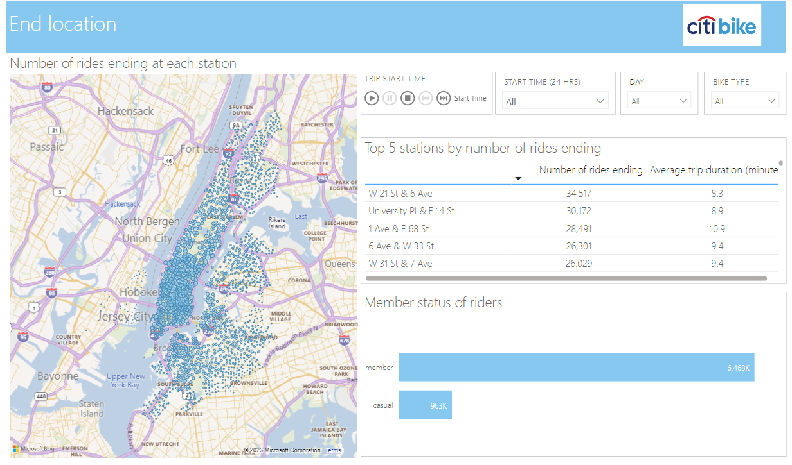

# Power BI - data visualisation of NYC Citi Bike Data

 ### **Overview**
Power BI was used to explore and visualise Citi Bike usage in New York City for the period December 2022 to March 2023 (inclusive).

 ### **Dataset**
 [Citi Bike data](https://citibikenyc.com/system-data) for the period December 2022 to March 2023 was used for analysis, which included almost 7.5 million trips.

  ### **Work flow**
  - Data files were loaded into power query and the data transformed accordingly.

  - A calendar table was created and marked as the date table

  - A data model was established

  - Visualisations were developed to explore the data. 

       The complete Power BI report can be viewed [here](https://app.powerbi.com/links/njqTqIwwy_?ctid=89e7c8a3-8cf5-4855-903e-94da701f571c&pbi_source=linkShare), screen shots of the pages are below.

 

---

### **Contact**
Email: kymcoleman@gmail.com

---